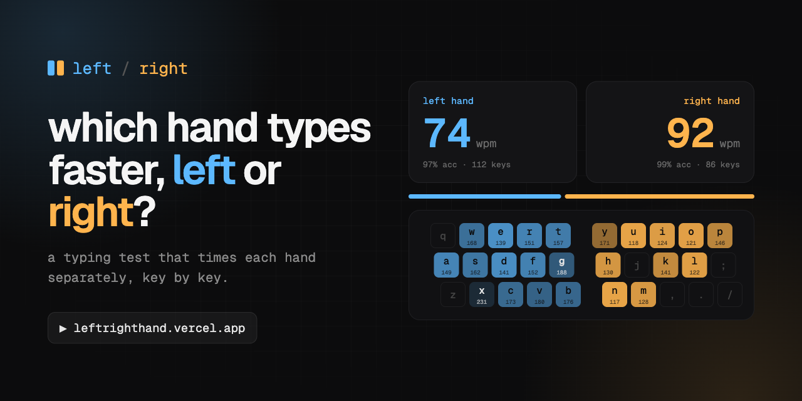
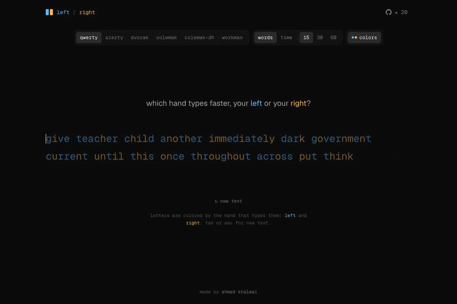

<p align="center">
  <a href="https://leftrighthand.pages.dev">
    
  </a>
</p>

<p align="center">
  <b>A typing test that times each hand separately.</b><br />
  Find out whether your left or right hand is faster, key by key, and see where you land against everyone else.
</p>

<p align="center">
  <a href="https://leftrighthand.pages.dev"><b>leftrighthand.pages.dev</b></a>
</p>

<p align="center">
  
</p>

## What you get

- **Speed per hand.** Separate wpm for your left and right hand, plus accuracy for each.
- **A key-by-key heatmap.** A split keyboard showing how long you take before every key. Your fastest and slowest keys are called out.
- **Where you stand.** Your right/left ratio is added to a live histogram for your layout, so you can see if you're more lopsided than most.
- **Share cards.** Every result gets its own link with a generated preview image, ready for X.
- **Six layouts.** QWERTY, AZERTY, Dvorak, Colemak, Colemak-DH and Workman, with word or timed tests.
- **Letters colored by hand** as you type, so you can see which hand each word leans on.

## How hand speed is measured

Every keystroke is timestamped. A key's time is the gap since the previous keystroke, and it only counts when:

1. both keys were typed correctly,
2. nothing was deleted in between, and
3. the gap is under a second (longer gaps are pauses, not speed).

Each letter belongs to the hand that types it in standard touch typing for the chosen layout. Hand wpm is `12000 / average gap in ms` (5 characters per word). Spaces are typed with a thumb, so they don't count for either hand.

## Run it locally

```bash
bun install
bunx wrangler d1 migrations apply leftrighthand --local   # a local database for the community histogram
bun dev
```

The community histogram is a small Cloudflare D1 table. In development it lives in a local file under `.wrangler/`.

## Deploy

The site runs on one Cloudflare Worker, built with [OpenNext](https://opennext.js.org/cloudflare). A push to `main` deploys it (`.github/workflows/deploy.yml`); `bun run deploy` does the same by hand. The short address, `leftrighthand.pages.dev`, is a small Cloudflare Pages project (`pages-proxy/`) that passes every request to the Worker; it only needs `bun run deploy:address` if that folder changes. `vercel.json` only redirects the old `leftrighthand.vercel.app` address to the new one.

## Stack

[Next.js 16](https://nextjs.org) · React 19 · Tailwind CSS 4 · [Cloudflare Workers](https://workers.cloudflare.com) and D1 · [PostHog](https://posthog.com) · Bun

Built to cost next to nothing: pages are static and refresh hourly, and a finished test is a single database write.
